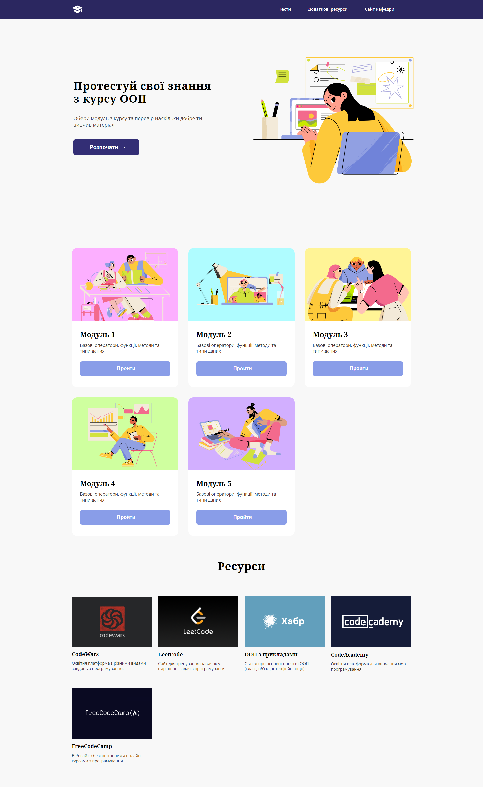
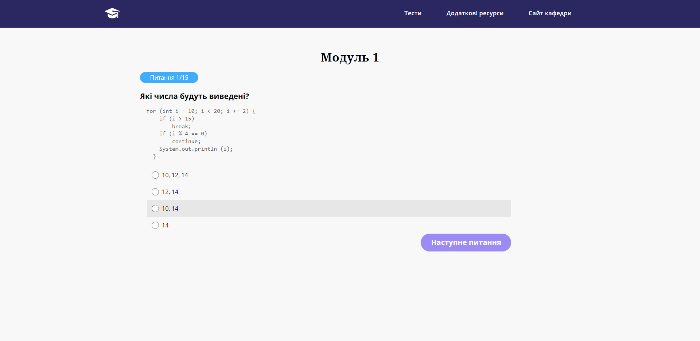

# Online quiz 

It is my second project using JavaScript on a website. 

The goal was to create a site for students that will help them to prepare for exams. The website must provide quizzes on every topic of the curriculum and additional resources for further impoving.
The students can do the quiz and see their results. 

## What I want to improve
1. Add a database for keeping right and wrong answers to show them in the end.
2. Add more tests
3. Save progress on every test, even if the page being reloaded

### Screenshot
  **Home Page**
  

  
  **Quiz page**
  

### Links

- Live Site URL: [here](https://bitterrsweetj.github.io/Online-quiz/)

## Author

- Instagram - [@bitterrsweetj](https://www.instagram.com/bitterrsweetj)
